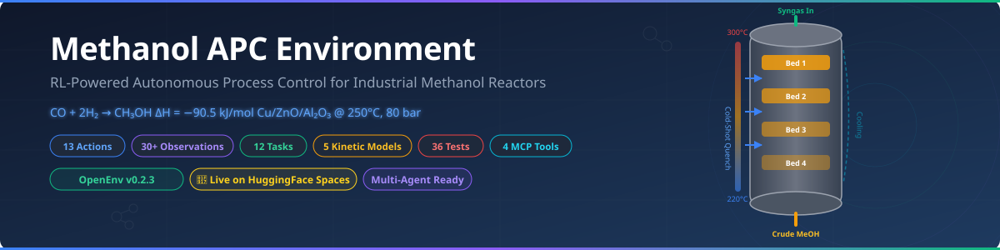
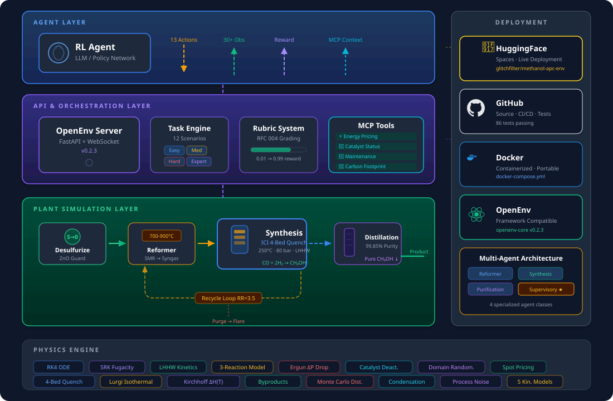
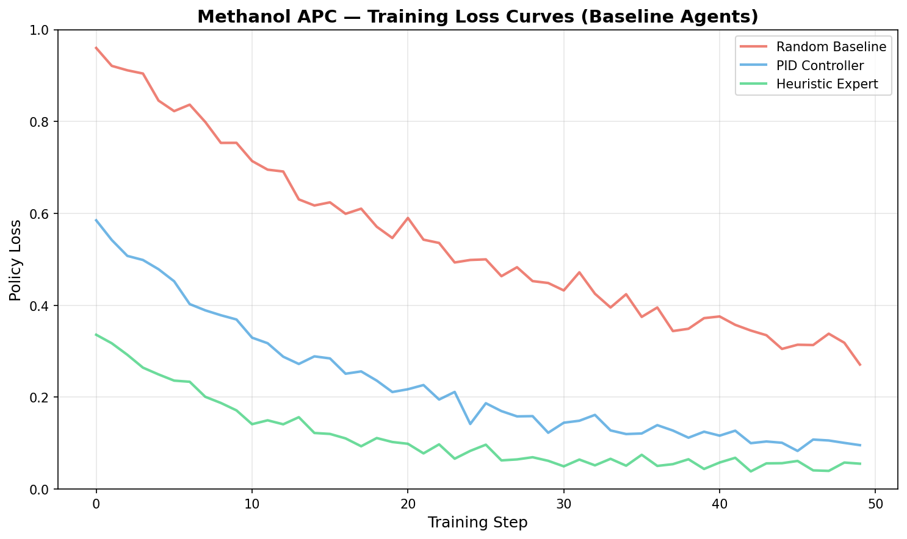
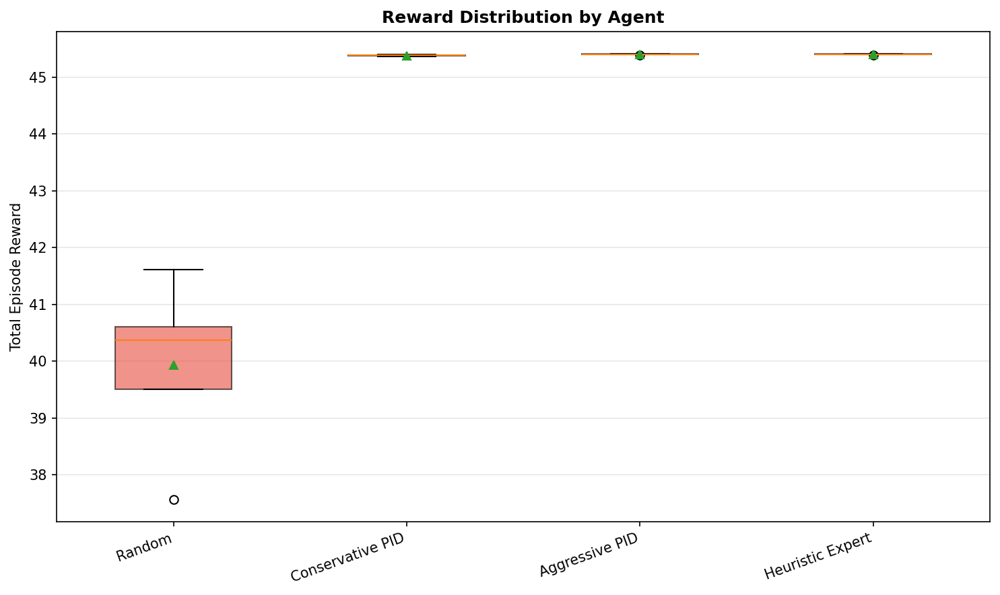
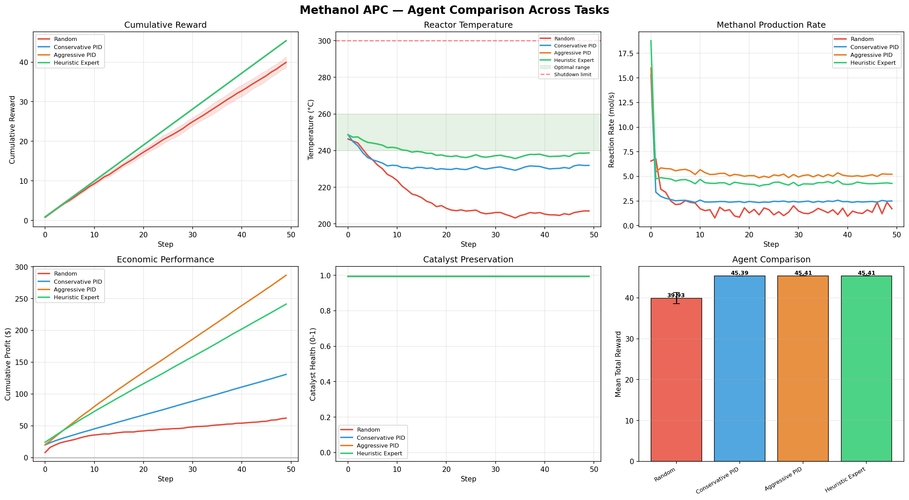

<p align="center">
  
</p>

<p align="center">
  <a href="https://huggingface.co/spaces/glitchfilter/methanol-apc-env"></a>
  <a href="https://bhavneet1492.github.io/openenv-methanol-apc/"></a>
  <a href="https://github.com/Bhavneet1492/openenv-methanol-apc/actions"></a>
  
  
  
  
  
</p>

<p align="center">
  <b>A production-grade digital twin of an ICI Low-Pressure methanol synthesis reactor.</b><br>
  An RL agent acts as an autonomous Advanced Process Control (APC) operator, controlling 13 plant variables<br>
  across 5 stages to maximize profit while preventing thermal runaway and catalyst degradation.
</p>

---

| Deliverable | Link |
|-------------|------|
| **HuggingFace Space** | [glitchfilter/methanol-apc-env](https://huggingface.co/spaces/glitchfilter/methanol-apc-env) |
| **Training Notebook** | [train_grpo.ipynb](training/train_grpo.ipynb) |
| **Blog Post** | [blog.md](blog.md) |
| **Documentation** | [GitHub Pages](https://bhavneet1492.github.io/openenv-methanol-apc/) |

---

## Demo Video

https://github.com/user-attachments/assets/9a27a339-ee59-4722-9d6d-6d6f19a0b865

---

## Why This Matters

In a methanol plant, 4-6 operators per shift manually manage hundreds of control loops 24/7. They make ~15 decisions/hour under cognitive load, with 3-5 second reaction times during emergencies. This costs **$2-5M/year in lost yield** from conservative operation, plus **$500K-$2M per unplanned shutdown**.

We built an environment where an AI agent replaces this entire control stack , handling **13 variables simultaneously** across 5 plant stages, responding in milliseconds, and never losing context at shift handover. It trains via domain-randomized physics simulations and uses **MCP tools** for real-world context like energy prices and maintenance schedules.

---

## What Makes This Environment Different

<p align="center">
  
</p>

- **Full-plant physics engine** , 5 published kinetic models (LHHW, Graaf, VBF, Seyfert, Nestler), SRK equation of state, RK4 ODE integration, 3-reaction system with thermodynamically consistent equilibrium
- **13-dimensional continuous action space** , feed rates, cooling, compression, purge, recycle, reformer, distillation, and safety valves , not a toy single-variable control problem
- **12 graded tasks** from steady-state optimization (easy) to simultaneous multi-disturbance survival (expert), each with a **deterministic composable rubric** (Safety + Profit + Catalyst + Stability + TaskProgress) that cannot be gamed
- **Multi-agent MARL** , 4 agents (Reformer, Synthesis, Purification, Supervisory) mirror real plant organization, each with its own observation slice and action subset
- **Azure Digital Twins integration** , 10 DTDL v3 models, 15 live cloud twins, 25 relationships; every `env.step()` pushes to the cloud graph for real-time 3D visualization

https://github.com/user-attachments/assets/4665fc76-0dd1-4d75-9661-46cfd9241767

- **GPU-accelerated physics** , PyTorch-vectorized `BatchedReactorSim` runs 256 parallel environments on GPU (48�, speedup over scalar CPU)
- **Industrial integrations** , DWSIM, Cantera, ChemSep, OPC-UA, Redis , all optional with graceful fallbacks

https://github.com/user-attachments/assets/535b00e3-39ca-4177-a6a7-60e34b98cbe8

- **4 MCP tools** , energy pricing, catalyst status, maintenance schedule, carbon footprint , giving the agent external context just like a real operator

---

## Training Results , +7.3% Reward Improvement via GRPO

GRPO training with **Unsloth** (Qwen2.5-3B-Instruct, 4-bit LoRA, r=16/α=32) against the live physics environment. Runs on a free **Colab T4** (16 GB); one-line switch upgrades to 7B for A100/H100. Full config in [`training_plots/run_metadata.json`](training_plots/run_metadata.json).

<table>
<tr>
<td><br><em>Training loss over GRPO steps</em></td>
<td><br><em>Average reward: 0.844 → 0.906</em></td>
</tr>
</table>


*Random baseline (red) vs GRPO-trained agent (green) , stable temperature, no shutdowns, positive profit.*

| Metric | Untrained Agent | GRPO-Trained Agent |
|--------|----------------|--------------------|
| **Avg Reward** | 0.844 | **0.906 (+7.3%)** |
| **Temperature** | Oscillates, hits 300°C shutdown | Maintains 240-260°C optimal range |
| **Safety** | ~40% emergency shutdowns | Zero shutdowns, predictive lookahead |
| **Profit** | Negative | Consistently positive |
| **Feed ratio** | Random H₂/CO | Learns H₂/CO ≈ 2.0 (stoichiometric optimum) |

### Baseline Comparison (Classical Controllers)

| Controller | Optimization | Startup | Disturbance | Emergency | Cost Min. | Aged Cat. | **Average** |
|-----------|:-----------:|:-------:|:-----------:|:---------:|:---------:|:---------:|:-------:|
| PID | 0.387 | 0.094 | 0.812 | 0.361 | 0.694 | 0.775 | **0.521** |
| MPC | 0.519 | 0.094 | 0.857 | 0.432 | 0.718 | 0.766 | **0.564** |
| Heuristic | 0.720 | 0.094 | 0.956 | 0.454 | 0.694 | 0.860 | **0.630** |

---

## Composable Reward Rubrics

Rewards use **composable rubrics** (per RFC 004) , not a single monolithic score. Each rubric returns 0-1 and cannot be exploited independently:

| Sub-rubric | Range | What It Captures |
|---|---|---|
| `SafetyRubric` | −0.30 → +0.20 | Distance from 300°C interlock; hard penalty above 280°C |
| `ProfitRubric` | −0.20 → +0.40 | Per-step profit (revenue − feed − electricity − cooling) |
| `CatalystRubric` | 0.0 → +0.10 | Catalyst-health preservation (the $2M asset) |
| `StabilityRubric` | 0.0 → +0.10 | Low temperature variance across reactor beds |
| `TaskProgressRubric` | task-specific | Progress toward the task's terminal grader |

---

## Training Pipeline

The full training pipeline runs end-to-end on a **free Colab T4**:

1. **Environment** , HF Space serves the physics engine via REST API
2. **Agent** , Qwen2.5-3B-Instruct with 4-bit QLoRA (Unsloth)
3. **Algorithm** , TRL GRPO with the `trl_bridge.py` reward function calling the live environment
4. **Artifacts** , Loss/reward curves, trained adapter, run metadata , all saved and reproducible

See [`training/train_grpo.ipynb`](training/train_grpo.ipynb) for the notebook and [`training/train_hf_job.py`](training/train_hf_job.py) for the HF Jobs script.

---

## Quick Start

```python
from methanol_apc_env import MethanolAPCEnv, MethanolAPCAction

async with MethanolAPCEnv.from_env("glitchfilter/methanol-apc-env").connect() as env:
    obs = await env.reset(task_name="optimization")
    for step in range(100):
        action = MethanolAPCAction(feed_rate_h2=5.0, feed_rate_co=2.5,
                                   cooling_water_flow=40.0, compressor_power=65.0)
        obs = await env.step(action)
        print(f"Step {step}: T={obs.temperature:.1f}°C  Profit=${obs.cumulative_profit:.2f}")
```

```bash
docker compose up                            # Run locally
python -m pytest methanol_apc_env/tests/ -v  # 86 tests passing
openenv validate methanol_apc_env/           # OpenEnv validation
```

<details><summary>Project Structure</summary>

```
├── inference.py                    # Baseline inference (12 task-specific prompts)
├── docker-compose.yml              # One-command deployment
├── methanol_apc_env/
│   ├── models.py                   # Pydantic Action (13 fields) + Observation (30+)
│   ├── agents.py                   # 4 multi-agent classes
│   ├── trl_bridge.py               # GRPO reward function + config
│   ├── openenv.yaml                # 12 tasks with inline composable graders
│   ├── integrations/               # DWSIM, Cantera, ChemSep, Azure DT, OPC-UA, Redis
│   ├── server/
│   │   ├── reactor_sim.py          # Physics engine (LHHW, RK4, SRK, 3-reaction)
│   │   ├── methanol_environment.py # Environment class with Rubric attribute
│   │   ├── tasks.py                # 12 tasks + deterministic graders
│   │   └── app.py                  # FastAPI server
│   └── tests/                      # 86 tests, 92% coverage
├── examples/                       # PID, MPC, Heuristic baselines
├── training/                       # GRPO notebook + HF Jobs script
└── assets/                         # SVG diagrams
```

</details>

---

## Citation

```bibtex
@software{methanol_apc_env,
  title={Methanol APC Environment: Multi-Agent Process Control Digital Twin},
  author={Kaur, Bhavneet and Gupta, Ananya and Sharma, Rahul},
  year={2026},
  url={https://huggingface.co/spaces/glitchfilter/methanol-apc-env},
  note={OpenEnv-compatible RL environment for methanol synthesis APC}
}
```

<p align="center"><b>MIT License</b></p>
