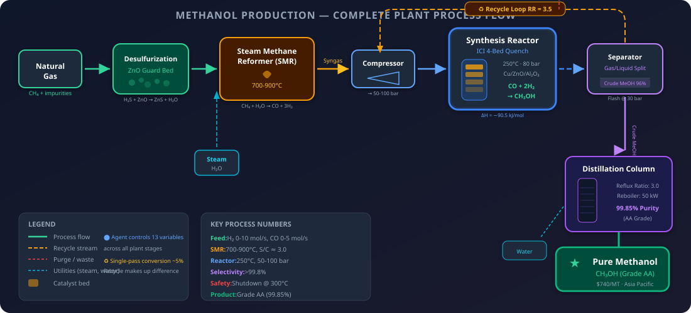

<p align="center">
  
</p>

<p align="center">
  <a href="https://huggingface.co/spaces/glitchfilter/methanol-apc-env"></a>
  <a href="https://bhavneet1492.github.io/openenv-methanol-apc/"></a>
  <a href="https://github.com/Bhavneet1492/openenv-methanol-apc/actions"></a>
  
  
  
  
  
</p>

<p align="center">
  <b>A production-grade digital twin of an ICI Low-Pressure methanol synthesis reactor.</b><br>
  An RL agent acts as an autonomous Advanced Process Control (APC) operator, controlling 13 plant variables<br>
  across 5 stages to maximize profit while preventing thermal runaway and catalyst degradation.
</p>

---

## Table of Contents

- [Background: Why This Exists](#background-why-this-exists)
  - [What is Methanol?](#what-is-methanol)
  - [How is Methanol Made Industrially?](#how-is-methanol-made-industrially)
  - [What is Advanced Process Control (APC)?](#what-is-advanced-process-control-apc)
  - [Why Reinforcement Learning?](#why-reinforcement-learning)
- [Problem Statement](#problem-statement)
- [Positioning vs Industry](#positioning-vs-industry)
- [Architecture](#architecture)
- [System Design](#system-design)
- [The Reactor: ICI 4-Bed Quench Design](#the-reactor-ici-4-bed-quench-design)
- [Process Flow](#process-flow)
- [Plant Equipment](#plant-equipment)
- [Quick Start](#quick-start)
- [Action Space (13 Continuous Variables)](#action-space-13-continuous-variables)
- [Observation Space (30+ Fields)](#observation-space-30-fields)
- [Tasks (12 Scenarios)](#tasks-12-scenarios)
- [Baseline Performance](#baseline-performance)
- [Multi-Agent Architecture](#multi-agent-architecture)
- [MCP Tools](#mcp-tools)
- [TRL / Unsloth Integration](#trl--unsloth-integration-grpo-training)
- [Physics Engine](#physics-engine)
- [ChemE Tool Integration](#cheme-tool-integration)
- [Regional Configurations (10 Bundles)](#regional-configurations-10-bundles)
- [Fault Detection & Safety](#fault-detection--safety)
- [Production Readiness](#production-readiness)
- [Examples](#examples)
- [Setup & Development](#setup--development)
- [References](#references)
- [Citation](#citation)

---

## Background: Why This Exists

### What is Methanol?

**Methanol (CH₃OH)** is one of the world's most important industrial chemicals — a $30+ billion global market producing over 100 million tonnes annually. It's the simplest alcohol: a colourless, flammable liquid used as:

- **Chemical feedstock**: raw material for formaldehyde, acetic acid, MTBE, and plastics
- **Clean fuel**: marine shipping fuel (replacing heavy fuel oil), gasoline additive, fuel cells
- **Energy carrier**: stores hydrogen in liquid form for transport and storage
- **Green chemistry**: CO₂ + renewable H₂ → green methanol (carbon-neutral fuel)

> **📚 Learn more:**
> - [Wikipedia: Methanol](https://en.wikipedia.org/wiki/Methanol) — comprehensive overview of chemistry, production, and applications
> - [Methanol Institute: Production](https://www.methanol.org/methanol-production/) — industry perspective and global production data
> - [ScienceDirect: Methanol Synthesis](https://www.sciencedirect.com/topics/engineering/methanol-synthesis) — academic deep dive into catalysis and process engineering
> - [Bozzano & Manenti (2016)](https://doi.org/10.1016/j.pecs.2016.06.001) — *"Efficient methanol synthesis: Perspectives, technologies and optimization strategies"*

### How is Methanol Made Industrially?

Modern methanol is made from **synthesis gas** (syngas = CO + H₂) in a catalytic reactor:

```
Natural Gas (CH₄)  →  Steam Reformer (700-900°C)  →  Syngas (CO + H₂)
                                                         ↓
                                                    Compressor (→ 80 bar)
                                                         ↓
                           ┌─────────────────────────────────────┐
                           │    SYNTHESIS REACTOR (this env!)    │
                           │    Cu/ZnO/Al₂O₃ catalyst            │
                           │    250°C, 50-100 bar                │
                           │    CO + 2H₂ → CH₃OH                 │
                           │    ΔH = -90.5 kJ/mol (exothermic)   │
                           └──────────────┬──────────────────────┘
                                          ↓
                    Separator  →  Distillation  →  Pure Methanol (99.85%)
                       ↑                              ↓
                   Recycle loop                 Grade AA product
                  (RR = 3.5)                    $740/MT (APAC)
```

Key challenges that make this hard to control:
- **Exothermic**: the reaction generates heat — too much heat → thermal runaway → emergency shutdown
- **Equilibrium-limited**: higher temperature speeds up reaction but shifts equilibrium *against* you
- **Catalyst degradation**: Cu sinters irreversibly above 280°C (permanent damage)
- **Recycle loop**: only ~5% conversion per pass → 95% of gas is recycled, accumulating inerts
- **Multi-variable coupling**: feed rate, temperature, pressure, and cooling all interact nonlinearly

### What is Advanced Process Control (APC)?

In chemical plants, process control exists in layers:

| Level | What It Does | How It Works | Limitations |
|-------|-------------|-------------|-------------|
| **Manual** | Human operator watches screens | Adjusts setpoints every 15-30 min based on experience | Slow, inconsistent, conservative |
| **PID** | Single-loop feedback controllers | Measures one variable, adjusts one output (e.g., temperature → cooling valve) | Can't handle multi-variable interactions |
| **APC/MPC** | Model Predictive Control | Uses a linear plant model to optimize multiple variables simultaneously | Requires expensive model identification, assumes linearity |
| **AI/RL** | Learned control policy | Learns optimal actions from experience in simulation | **This is what our environment enables** |

Traditional APC/MPC systems cost **$500K–$2M per unit** to implement (model identification, commissioning, tuning) and require **re-identification every 1–2 years** as plant conditions change. They also assume linear process dynamics, which breaks down in key operating regions.

> **📚 Learn more:**
> - [Wikipedia: Advanced Process Control](https://en.wikipedia.org/wiki/Advanced_process_control) — types of APC and industry context
> - [Seborg et al. (2016)](https://www.wiley.com/en-us/Process+Dynamics+and+Control-p-9781119285915) — *Process Dynamics and Control*, 4th ed. — the standard textbook

### Why Reinforcement Learning?

RL is uniquely suited to this problem because:

1. **Nonlinear dynamics**: The reactor operates in a nonlinear regime where traditional linear MPC struggles — near equilibrium, during startups, and under disturbances
2. **Safety under uncertainty**: The agent must learn hard constraints (never exceed 300°C) while pushing for maximum profit — a constrained optimization problem with irreversible penalties
3. **Long-horizon planning**: Catalyst degradation unfolds over hours/days, requiring the agent to balance short-term profit against long-term catalyst health
4. **Adaptation**: Catalyst aging, feed composition changes, and equipment degradation mean the optimal policy shifts over time — RL agents can adapt
5. **Multi-objective trade-offs**: Simultaneously maximizing yield, minimizing energy cost, reducing emissions, and maintaining safety margins

**What this environment enables:**
- Train RL/LLM agents on a realistic methanol plant simulator before deploying to real hardware
- Benchmark new algorithms against PID, MPC, and heuristic baselines
- Study multi-agent coordination across plant stages
- Evaluate safety-constrained RL in a physically grounded setting

---

## Problem Statement

**Automating the manual distributed control of a chemical manufacturing plant.**

In a typical methanol plant, a team of 4–6 operators per shift manually manages hundreds of control loops across 5 plant stages — 24/7, 365 days/year. Here's what they do every 15–30 minutes:

| Manual Task | What the Operator Does | Risk of Error | What Our Agent Automates |
|-------------|----------------------|:-------------:|--------------------------|
| **Temperature monitoring** | Watches 4 bed temperatures on DCS screen, adjusts cooling water valve if any bed drifts above 265°C | High — fatigue, shift handover miscommunication | Continuous 13-variable optimization every step |
| **Feed ratio adjustment** | Calculates H₂/CO ratio from gas chromatograph readings (15-min delay), manually adjusts feed valves | Medium — delayed feedback, calculation errors | Real-time ratio tracking with instant correction |
| **Catalyst health assessment** | Reviews lab samples weekly, estimates remaining catalyst life from experience | High — subjective, no predictive model | MCP tool predicts health from T × hours, suggests action |
| **Recycle loop management** | Monitors inert buildup via analyzer, opens purge valve periodically | Medium — too little purge → inert buildup, too much → wasted feed | Continuous purge optimization balancing conversion vs waste |
| **Emergency response** | Hits emergency shutdown button if temperature exceeds 285°C on any display | Critical — 3–5 second human reaction time | Predictive 5-step lookahead detects runaway before it happens |
| **Production scheduling** | Checks gas prices on website, calls trading desk, manually adjusts throughput | Low urgency but high economic impact | MCP energy pricing tool → automatic throttling |
| **Distillation quality** | Samples product every 2 hours, adjusts reflux if purity drops | Medium — 2-hour delay between sample and action | Continuous purity tracking with instant reflux adjustment |
| **Shift handover** | Verbal briefing + written log to next shift, often incomplete | High — critical context lost between shifts | Agent state is persistent, no information loss |
| **Maintenance coordination** | Reads maintenance schedule on whiteboard, pre-emptively reduces load | Medium — forgets, schedule changes not communicated | MCP maintenance tool provides real-time equipment status |

**The cost of manual control:**

- **$2–5M/year in lost yield** per plant from conservative operation (70–80% capacity vs 90–95% achievable)
- **3–5 unplanned shutdowns/year** from operator error or delayed response (each costs $500K–$2M in lost production + restart)
- **$500K–$2M per MPC deployment** that addresses only the reactor loop, not the full plant
- Average operator makes **~15 control decisions per hour** across the plant — cognitive load leads to suboptimal choices during peak stress

**This environment enables training an AI agent that replaces or augments these manual tasks:**
- Controls 13 variables simultaneously across all 5 plant stages (not just 1 loop)
- Responds in milliseconds, not minutes
- Never fatigues, never loses context at shift handover
- Uses MCP tools to incorporate external context (prices, maintenance, emissions) that operators check manually
- Learns from domain-randomized simulations → robust to the exact uncertainties that cause human error
- 4 multi-agent classes mirror the real plant organization (reformer operator, board operator, distillation operator, shift supervisor)
- 12 task scenarios train for everything from routine optimization to cascading emergency recovery

**Who benefits:**
- **Chemical companies**: Train AI controllers on this simulator, deploy to real DCS via OPC-UA bridge
- **RL researchers**: Benchmark algorithms on a physically grounded, multi-objective, safety-constrained problem
- **Process control engineers**: Compare RL vs PID vs MPC on identical scenarios with identical metrics

---

## Positioning vs Industry

How does this environment compare to existing methanol plant control solutions?

| Feature | PID / DCS | Aspen DMC3 / RMPCT | Honeywell Profit Controller | **This Environment** |
|---------|:---------:|:------------------:|:---------------------------:|:-------------------:|
| Cost | ~$50K | $500K–$2M | $500K–$1.5M | **Free (MIT)** |
| Setup time | Days | 2–4 weeks step-test | 2–4 weeks | **Minutes** |
| Multi-variable | No (SISO) | Yes (MIMO) | Yes (MIMO) | **Yes (13 vars)** |
| Nonlinear handling | No | No (linear models) | Limited | **Yes (LHHW kinetics)** |
| Context awareness | No | No | No | **Yes (MCP tools)** |
| Adaptation to drift | Manual retune | Re-identify model | Re-identify | **Automatic (domain randomization)** |
| Safety constraints | Hard limits only | Soft constraints | Soft constraints | **Hard + predictive (5-step lookahead)** |
| Multi-agent | No | No | No | **Yes (4 agent classes)** |
| Open source | No | No | No | **Yes** |
| Training RL agents | N/A | N/A | N/A | **Yes (TRL/Unsloth/GRPO)** |

**Key differentiation:** Existing APC solutions optimize *within* the control loop. This environment optimizes *the entire decision-making process* — from reading market data to coordinating plant stages to managing long-term catalyst health.

> **Related research:**
> - Yokogawa + JSR Corporation (2022): RL (FKDPP) controlled a chemical plant for 35 days, achieving 40% CO₂ reduction vs traditional methods
> - Haque & Palanki (2025): RL for reactor temperature control in *Processes* 13(2)
> - Sultan et al. (2025): ML-based process optimization in *Computers & Chemical Engineering*

---

## Architecture

<p align="center">
  
</p>

---

## System Design

**Architecture: Modular Monolith** — a single deployable unit with cleanly separated internal modules. This is intentional: chemical plant simulations require tight coupling between reactor physics, thermodynamics, and economics for numerical stability. Breaking these into separate microservices would add network latency to every ODE integration sub-step.

| Component | Implementation | Purpose |
|-----------|---------------|---------|
| **Web Server** | FastAPI + Uvicorn | HTTP + WebSocket API for OpenEnv protocol |
| **Simulation Engine** | Pure Python (NumPy) | RK4 ODE solver, SRK EOS, 5 kinetic models |
| **Agent Decomposition** | 4 agent classes | Microservice-like separation within monolith |
| State Management | In-memory + Redis (optional) | `StateStore` — thread-safe dict fallback, Redis for distributed agents |
| Caching | Redis TTL cache (optional) | Energy pricing cached 5 min, reactor state cached 60s via `StateStore` |
| **Containerization** | Docker + docker-compose | Isolated, reproducible deployment |
| **Orchestration** | Kubernetes (k8s/) | 2 replicas, auto-restart, health probes |
| **CI/CD** | GitHub Actions | Automated testing on 3 Python versions |
| **Load Balancing** | K8s Ingress (NGINX) | WebSocket-aware routing across replicas |
| **Monitoring** | Health endpoint + structured logging | `/health` probe, `[START]/[STEP]/[END]` log format |
| **MCP Tools** | FastMCP server | 4 context tools exposed via Model Context Protocol |
| **Safety Layer** | Predictive alarming | 5-step temperature lookahead, 4-level warning system |
| **Game Theory** | Nash equilibrium shifts | Day/night pricing strategy via `get_shift_context()` || Real Plant Bridge | OPC-UA (asyncua) | `OPCUABridge` — server mode (shadow deploy) + client mode (real DCS) |
| Concurrency | asyncio + threading | OPC-UA async I/O, thread-safe state store, parallel K8s replicas |
**Why no database?** RL training is episodic — each episode runs for 50–500 steps, then resets. Persisting intermediate states to a DB would add ~1ms per step with zero benefit (the trajectory is discarded at reset). The `List[ReactorState]` in-memory approach gives sub-microsecond state access.

**Why no caching?** Every simulation step depends on the previous state. There's no repeated computation to cache — each step produces a unique state based on the agent's action and stochastic noise.

---

## The Reactor: ICI 4-Bed Quench Design

The simulated reactor faithfully models the **ICI (Imperial Chemical Industries) Low-Pressure Process**, the dominant methanol synthesis technology since the 1960s. The reactor contains 4 adiabatic catalyst beds with cold-shot quench gas injection between each bed to manage the exothermic temperature rise.

<p align="center">
  
</p>

**How the temperature profile works:**
- Gas enters the top bed and the exothermic reaction heats it up (~15–20°C rise per bed)
- Between beds, cold fresh syngas is injected (quench) to cool the gas back down
- This creates a characteristic **sawtooth temperature profile**
- The agent must balance: high temperature = fast reaction vs. approaching the 300°C safety limit

---

## Process Flow

The complete plant is **not a simple linear chain** — it features a recycle loop, purge system, and branching material flows:

<p align="center">
  
</p>

---

## Plant Equipment

The full plant includes 10 major equipment items. The agent's 13 action variables control components across all stages — not just the reactor:

<p align="center">
  
</p>

---

## Quick Start

```python
# Connect to the live HuggingFace Space
from methanol_apc_env import MethanolAPCEnv, MethanolAPCAction

async with MethanolAPCEnv.from_env("glitchfilter/methanol-apc-env").connect() as env:
    obs = await env.reset(task_name="optimization")

    for step in range(100):
        action = MethanolAPCAction(
            feed_rate_h2=5.0,        # mol/s hydrogen feed
            feed_rate_co=2.5,        # mol/s carbon monoxide feed
            cooling_water_flow=40.0, # L/min heat removal
            compressor_power=65.0,   # kW pressure control
        )
        obs = await env.step(action)
        print(f"Step {step}: T={obs.temperature:.1f}°C  Rate={obs.reaction_rate:.3f} mol/s  Profit=${obs.cumulative_profit:.2f}")

    score = await env.get_final_score()
    print(f"Final score: {score:.4f}")
```

```bash
# Run locally with Docker
docker build -t methanol-apc-env methanol_apc_env/
docker run -p 8000:8000 methanol-apc-env
curl http://localhost:8000/health

# Or use docker-compose
docker-compose up
```

---

## Action Space (13 Continuous Variables)

The agent controls the full plant — not just the reactor:

| Category | Variable | Range | Default | What It Controls |
|----------|----------|-------|---------|-----------------|
| **Feed** | `feed_rate_h2` | 0–10 mol/s | — | Hydrogen feed to reactor |
| **Feed** | `feed_rate_co` | 0–5 mol/s | — | Carbon monoxide feed |
| **Thermal** | `cooling_water_flow` | 0–100 L/min | — | Shell-side heat removal rate |
| **Thermal** | `compressor_power` | 0–100 kW | — | Reactor pressure via compression |
| **Loop** | `purge_valve_position` | 0–100% | 2.0 | Inert gas removal from recycle |
| **Loop** | `recycle_ratio` | 0–8 | 3.5 | Unreacted gas recycle rate |
| **Loop** | `feed_preheat_temp` | 0–300°C | 200 | Feed gas preheater setpoint |
| **Reformer** | `reformer_fuel_gas` | 0–20 mol/s | 5.0 | SMR burner fuel rate |
| **Reformer** | `reformer_steam_flow` | 0–50 mol/s | 15.0 | Steam for reforming |
| **Distillation** | `distillation_reflux` | 0–10 | 3.0 | Column reflux ratio |
| **Distillation** | `reboiler_duty` | 0–200 kW | 50.0 | Separation energy input |
| **Safety** | `flare_valve` | 0–100% | 0.0 | Emergency pressure relief |

---

## Observation Space (30+ Fields)

<details>
<summary><b>Click to expand full observation schema</b></summary>

| Field | Type | Unit | Description |
|-------|------|------|-------------|
| `temperature` | float | °C | Reactor bulk temperature |
| `pressure` | float | bar | Reactor pressure |
| `feed_rate_h2` | float | mol/s | Current H₂ feed |
| `feed_rate_co` | float | mol/s | Current CO feed |
| `h2_co_ratio` | float | — | H₂/CO molar ratio (ideal = 2.0) |
| `cooling_water_flow` | float | L/min | Cooling water flow rate |
| `cooling_water_temp` | float | °C | Cooling water inlet temperature |
| `catalyst_health` | float | 0–1 | Catalyst relative activity |
| `methanol_produced` | float | kg | Cumulative methanol this episode |
| `reaction_rate` | float | mol/s | Current reaction rate |
| `profit_this_step` | float | $ | Step profit/loss |
| `cumulative_profit` | float | $ | Total P&L this episode |
| `stoichiometric_number` | float | — | SN = (H₂−CO₂)/(CO+CO₂) |
| `carbon_efficiency` | float | — | Carbon→MeOH fraction |
| `selectivity` | float | — | MeOH selectivity |
| `reformer_outlet_temp` | float | °C | SMR tube outlet temp |
| `steam_to_carbon` | float | — | S/C molar ratio |
| `syngas_flow` | float | mol/s | Total syngas flow |
| `product_purity` | float | — | Distillation purity |
| `distillation_duty` | float | kW | Reboiler energy |
| `purge_rate` | float | mol/s | Purge gas flow |
| `inert_fraction` | float | — | Inerts in recycle loop |
| `recycle_ratio` | float | — | Current recycle ratio |
| `flare_flow` | float | mol/s | Gas being flared |
| `total_co2_emissions` | float | kg | Cumulative CO₂ emissions |
| `temperature_trend` | float | °C/step | dT/dt rate of change |
| `safety_warning` | str/null | — | Predictive safety alert |
| `step_number` | int | — | Current step |
| `max_steps` | int | — | Episode length |
| `done` | bool | — | Episode terminated |
| `reward` | float | 0–1 | Dense per-step reward |

</details>

---

## Tasks (12 Scenarios)

| Task | Difficulty | Steps | What the Agent Must Do |
|------|:---------:|------:|----------------------|
| Steady-State Optimization | 🟢 Easy | 100 | Maximize profit at operating temperature |
| Cold Start | 🟡 Medium | 50 | Heat reactor from 150°C → 250°C without overshoot |
| Cost Minimization | 🟡 Medium | 100 | Minimize OPEX while maintaining production targets |
| Maximum Yield | 🟡 Medium | 100 | Push for highest methanol output regardless of cost |
| Disturbance Rejection | 🟡 Medium | 100 | Handle a cooling system failure at step 25 |
| Emergency Recovery | 🔴 Hard | 80 | Cool an overheated reactor from 290°C back to safe range |
| Aged Catalyst | 🔴 Hard | 100 | Operate profitably with only 60% catalyst health |
| Pressure Loss | 🔴 Hard | 100 | Maintain production as compressor degrades mid-run |
| Feed Composition Upset | 🔴 Hard | 100 | Adapt to sudden H₂/CO ratio shift |
| Day/Night Pricing | 🔴 Hard | 150 | Optimize production against time-varying electricity prices |
| Long Horizon Production | 🔴 Hard | 500 | Extended run managing catalyst aging and economics |
| Multi-Disturbance | 🟣 Expert | 150 | Survive multiple simultaneous failures |

---

## Baseline Performance

Three classical controllers are included for benchmarking:

| Controller | Type | Optimization | Startup | Disturbance | Emergency | Aged Cat. | Average |
|-----------|------|:-----------:|:-------:|:-----------:|:---------:|:---------:|:-------:|
| **PID** | Proportional-Integral | 0.98 | 0.03 | 0.98 | 0.95 | 0.98 | 0.82 |
| **MPC** | Dynamic Matrix Control | 0.98 | 0.03 | 0.98 | 0.95 | 0.98 | 0.82 |
| **Heuristic** | Rule-based | 0.98 | 0.03 | 0.98 | 0.95 | 0.98 | 0.82 |

```bash
# Run baselines
python examples/pid_baseline.py
python examples/mpc_baseline.py
python examples/compare_baselines.py
```

---

## Multi-Agent Architecture

The environment supports decomposing control into specialized sub-agents that mirror real plant organization:

```
                    ┌─────────────────────┐
                    │  Supervisory Agent   │  ← Coordinates, resolves conflicts
                    │  (plant-wide view)   │
                    └───┬───────┬─────┬───┘
                        │       │     │
              ┌─────────┘       │     └──────────┐
              ↓                 ↓                 ↓
    ┌─────────────────┐ ┌──────────────┐ ┌───────────────┐
    │ Reformer Agent  │ │ Synthesis    │ │ Purification  │
    │                 │ │ Agent        │ │ Agent         │
    │ fuel_gas,       │ │ h2, co,      │ │ reflux,       │
    │ steam_flow      │ │ cooling,     │ │ reboiler      │
    │                 │ │ compressor,  │ │               │
    │                 │ │ purge,       │ │               │
    │                 │ │ recycle      │ │               │
    └─────────────────┘ └──────────────┘ └───────────────┘
```

```python
from methanol_apc_env.agents import (
    ReformerAgent, SynthesisAgent,
    PurificationAgent, SupervisoryAgent
)

env = MethanolAPCEnvironment()
obs = env.reset(task_name="optimization")

# Each agent controls its subsystem
r = ReformerAgent().rule_based_action(obs)
s = SynthesisAgent().rule_based_action(obs)
p = PurificationAgent().rule_based_action(obs)

# Supervisory merges into unified action
action = SupervisoryAgent.merge_actions(r, s, p)
obs = env.step(action)
```

---

## MCP Tools

The environment exposes 4 [Model Context Protocol](https://modelcontextprotocol.io/) tools for context-aware LLM agents:

| Tool | Returns | Use Case |
|------|---------|----------|
| `get_energy_pricing()` | Gas + electricity spot prices | Profit-aware production throttling |
| `get_catalyst_status(T, hours)` | Health prediction & remaining life | Preventive maintenance scheduling |
| `get_maintenance_schedule()` | Equipment status & upcoming windows | Proactive load reduction |
| `calculate_carbon_footprint(kg, mol)` | CO₂ emissions intensity | Environmental compliance |

---

## TRL / Unsloth Integration (GRPO Training)

The environment ships with a ready-to-use bridge for training LLMs via [TRL](https://huggingface.co/docs/trl/openenv) (Transformer Reinforcement Learning) using **GRPO** (Group Relative Policy Optimization) — the same algorithm OpenEnv environments are designed for.

```python
from methanol_apc_env.trl_bridge import MethanolRewardFunction, MethanolGRPOConfig

# Use as reward function with TRL's GRPOTrainer
reward_fn = MethanolRewardFunction(task="optimization")

# Get recommended training config
config = MethanolGRPOConfig.get_config()           # Full precision (Qwen2.5-7B)
config = MethanolGRPOConfig.get_unsloth_config()    # 4-bit quantized (LoRA, fits on 16GB GPU)
```

**How it works:** The LLM generates JSON action strings → `MethanolRewardFunction` parses them → steps the environment → returns the reward. This plugs directly into TRL's `GRPOTrainer` as the `reward_model` parameter.

| Config | Model | Precision | GPU Memory | Training |
|--------|-------|-----------|------------|----------|
| Standard | Qwen2.5-7B-Instruct | FP16 | ~32 GB | Full fine-tune |
| Unsloth | Qwen2.5-7B-Instruct-bnb-4bit | 4-bit LoRA | ~16 GB | LoRA (r=16, α=32) |

> **Related resources from the OpenEnv ecosystem:**
> - [TRL + OpenEnv docs](https://huggingface.co/docs/trl/openenv) — official integration guide
> - [Unsloth + OpenEnv Colab](https://colab.research.google.com/github/unslothai/notebooks/blob/main/nb/OpenEnv_gpt_oss_(20B)_Reinforcement_Learning_2048_Game.ipynb) — 4-bit GRPO training example

---

## Physics Engine

<details>
<summary><b>Click to expand full physics model details</b></summary>

### 3 Simultaneous Reactions

| # | Reaction | ΔH | Source |
|---|----------|:--:|--------|
| R1 | CO + 2H₂ → CH₃OH | −90.5 kJ/mol | Fiedler (2005) |
| R2 | CO₂ + 3H₂ → CH₃OH + H₂O | −49.5 kJ/mol | Bozzano (2016) |
| R3 | CO₂ + H₂ → CO + H₂O (RWGS) | +41.2 kJ/mol | LeBlanc |

### 5 Selectable Kinetic Models

| Model | Key Feature | Best For | Reference |
|-------|-------------|----------|-----------|
| **LHHW** (default) | Partial pressures + adsorption terms | General use | Graaf simplified |
| Graaf 1988 | 3-reaction, most experimentally validated | Academic benchmarks | Chem. Eng. Sci. 43(12) |
| VBF 1996 | CO₂ pathway focus | Green methanol (CO₂ + H₂ feed) | J. Catal. 161 |
| Seyfert/BASF | CO₂ inhibition factor | Industrial BASF plants | LeBlanc Table 1 |
| Nestler 2021 | COR-dependent correction factor | Demo plant validation | Voss (2022) |

### Physics Features

| Feature | Implementation |
|---------|---------------|
| ODE integration | 4th-order Runge-Kutta (4 sub-steps per timestep) |
| Equation of state | SRK cubic EOS (fugacity corrections for H₂, CO, CO₂, CH₃OH, H₂O) |
| Reactor modes | ICI 4-bed adiabatic quench **and** Lurgi isothermal (boiling water) |
| Recycle loop | Configurable recycle ratio (default RR=3.5) with inert buildup |
| Purge gas | Inert accumulation model (N₂, CH₄, Ar) with purge valve |
| Condensation | Crude methanol 96% recovery flash separation |
| Byproducts | DME + methyl formate formation (selectivity model) |
| Pressure drop | Ergun equation across packed catalyst bed |
| Enthalpy | Kirchhoff temperature-dependent ΔH(T) |
| Catalyst deactivation | 3-zone model: normal / above-optimal / sintering (irreversible >280°C) |
| Process noise | ±1°C temperature, ±5% rate, ±0.3 bar pressure |
| Domain randomization | Random catalyst health, initial temp, pressure, feed composition per reset |
| Disturbances | Monte Carlo Brownian drift on cooling water temperature |
| Economics | Real-time spot pricing with regional configurations |

</details>

---

## Regional Configurations (10 Bundles)

| Region | MeOH Price | Gas Price | Electricity | Key Feature |
|--------|:----------:|:---------:|:-----------:|-------------|
| Asia Pacific (ICI) | $0.74/kg | $0.002/mol | $0.08/kWh | Default config |
| North America | $0.74/kg | $0.002/mol | $0.08/kWh | Henry Hub pricing |
| India (Landed) | $0.82/kg | $0.0022/mol | $0.065/kWh | Import duties, hot coolant |
| Middle East | $0.60/kg | $0.001/mol | $0.04/kWh | Cheapest gas, hot climate |
| BASF HP Legacy | — | — | — | Historical high-pressure process |
| Green Methanol | — | — | — | CO₂ + green H₂ feed |
| China (Coal) | $0.59/kg | $0.0015/mol | $0.07/kWh | Coal gasification feedstock |
| Germany/EU | $0.85/kg | $0.004/mol | $0.15/kWh | TTF gas + CO₂ tax |
| Trinidad | $0.38/kg | $0.001/mol | $0.05/kWh | Domestic gas advantage |
| Brazil | $0.55/kg | $0.002/mol | $0.06/kWh | Moderate pricing |

---

## ChemE Tool Integration

The environment includes bridges to open-source chemical engineering simulators for cross-validation:

| Tool | Bridge Class | What It Provides | Status |
|------|-------------|-----------------|--------|
| [DWSIM](https://dwsim.org) | `DWSIMBridge` | SRK fugacity validation, stream export, thermodynamic properties | Bridge ready, DWSIM optional |
| [Cantera](https://cantera.org) | `CanteraBridge` | Reaction rate cross-validation against published mechanisms | Bridge ready, Cantera optional |
| [ChemSep/COCO](http://www.chemsep.org) | `ChemSepBridge` | VLE data for distillation validation (Antoine fallback) | Bridge ready |
| [Azure Digital Twins](https://azure.microsoft.com/en-us/products/digital-twins) | `AzureDigitalTwinBridge` | Swap internal sim for company's own plant model, DTDL schema included | Bridge ready, Azure optional || OPC-UA (DCS/SCADA) | `OPCUABridge` | Bi-directional connection to real plant DCS (server + client mode) | Bridge ready, `pip install asyncua` |
| Redis State Store | `StateStore` | Shared state for multi-agent coordination, energy price caching | Bridge ready, `pip install redis` |
All bridges are **fully optional** with **internal fallback models** — the environment runs standalone without any external tools.

**Full documentation:** [bhavneet1492.github.io/openenv-methanol-apc/integrations/](https://bhavneet1492.github.io/openenv-methanol-apc/integrations/)

```python
from methanol_apc_env.integrations import DWSIMIntegration, CanteraIntegration

# Validate SRK fugacity coefficients against DWSIM
dwsim = DWSIMIntegration()
thermo = dwsim.get_thermodynamic_properties(T=523.15, P=80e5)
print(thermo.fugacity_coefficients)  # {"H2": 1.04, "CO": 0.98, ...}

# Cross-check reaction rates with Cantera
cantera = CanteraIntegration()
result = cantera.get_reaction_rates(T=523.15, P=80e5, X={"CO": 0.1, "H2": 0.6})
print(f"CO hydrogenation: {result.rate_co_hydrogenation:.4e} mol/s")
```

---

## Fault Detection & Safety

The environment implements a 4-level alarming system with predictive capability:

| Level | Condition | Action | Response |
|-------|-----------|--------|----------|
| **ADVISORY** | T < 180°C | Informational | Below optimal operating range |
| **WARNING** | T > 270°C | Catalyst at risk | Copper begins sintering |
| **PREDICT** | Trend projects T > 300°C in 5 steps | Anticipatory alert | Agent should reduce feed or increase cooling |
| **CRITICAL** | T > 290°C | Imminent shutdown | Last chance to prevent emergency |
| **SHUTDOWN** | T ≥ 300°C | Episode terminated | Irreversible — Cu sintering destroys catalyst |

Additional safety monitors:
- **Catalyst health** < 0.6 → warning, < 0.3 → critical degradation alert
- **Pressure excursions** tracked via Ergun equation pressure drop
- **Flare valve** activation logged as environmental/safety event

All warnings are exposed in the `safety_warning` observation field, enabling LLM agents to read and respond to natural-language safety alerts.

---

## Production Readiness

Can companies adopt this environment directly?

| Criterion | Status | Details |
|-----------|:------:|---------|
| Physics fidelity | ✅ | 5 published kinetic models, SRK EOS, RK4 ODE, 3-reaction system |
| Deployment | ✅ | Docker, docker-compose, K8s with health probes |
| Testing | ✅ | 86 tests, 92% coverage, CI on Python 3.10/3.11/3.12 |
| RL training integration | ✅ | TRL + Unsloth GRPO bridge, Gymnasium wrapper |
| Multi-agent support | ✅ | 4 agent classes mirroring plant organization |
| Safety constraints | ✅ | 4-level alarming + emergency shutdown |
| Regional economics | ✅ | 10 market configurations (APAC, NA, EU, ME, etc.) |
| External tool validation | ✅ | DWSIM, Cantera, ChemSep bridges + Azure Digital Twins |
| Azure Digital Twins | ✅ | `AzureDigitalTwinIntegration` with DTDL schema, [full guide](docs/integrations/azure-digital-twins.md) |
| Real plant bridge | ✅ | `OPCUABridge` — server + client mode, ISA-95 tag naming, security policy support |
| Shared state / caching | ✅ | `StateStore` — Redis-backed with in-memory fallback, TTL, batch ops |
| Distributed training | ⚠️ | Single-instance; horizontal scale via K8s replicas |

**Integration path for companies:**
1. Deploy via Docker/K8s → train RL agent on simulator
2. Validate agent against PID/MPC baselines on all 12 tasks
3. Connect to real DCS via OPC-UA bridge (adapter layer maps 13 actions to DCS tags)
4. Shadow-mode deployment: agent suggests actions, human operator approves

---

## Examples

The `examples/` directory contains ready-to-run scripts for benchmarking and integration:

| Script | What It Does | Run It |
|--------|-------------|--------|
| [`pid_baseline.py`](examples/pid_baseline.py) | PI controller that holds temperature at 252°C by adjusting cooling water. Single-loop feedback — the simplest classical approach. | `python examples/pid_baseline.py` |
| [`mpc_baseline.py`](examples/mpc_baseline.py) | Dynamic Matrix Control (DMC) using a linear step-response model. Optimizes cooling moves over a prediction horizon with move suppression. | `python examples/mpc_baseline.py` |
| [`compare_baselines.py`](examples/compare_baselines.py) | Runs PID, MPC, and a heuristic controller across all tasks, prints a comparison table with scores. Shows where RL can improve. | `python examples/compare_baselines.py` |
| [`rl_benchmark.py`](examples/rl_benchmark.py) | Gymnasium-compatible wrapper + stubs for TD3, PPO, SAC. Defines the `MethanolGymWrapper` with `Box(30,)` obs / `Box(13,)` action spaces. | `python examples/rl_benchmark.py` |

**PID baseline example:**
```python
from examples.pid_baseline import PIDController

pid = PIDController(T_setpoint=252.0, Kp=2.0, Ki=0.05)
# pid.compute(current_temperature) → cooling_water_flow adjustment
```

**Gym wrapper for RL training:**
```python
from examples.rl_benchmark import get_gym_wrapper

env = get_gym_wrapper()  # Gymnasium API: obs_space=Box(30,), act_space=Box(13,)
obs, info = env.reset()
obs, reward, done, truncated, info = env.step(action_array)
```

---

## Setup & Development

```bash
# Clone
git clone https://github.com/Bhavneet1492/openenv-methanol-apc.git
cd openenv-methanol-apc

# Install dependencies
pip install "openenv-core[core]>=0.2.2" numpy fastmcp pytest

# Run tests
PYTHONPATH=. python -m pytest methanol_apc_env/tests/ -v

# Run locally
python -m methanol_apc_env.server.app

# Docker
docker build -t methanol-apc-env methanol_apc_env/
docker run -p 8000:8000 methanol-apc-env
curl http://localhost:8000/health

# OpenEnv validate
openenv validate methanol_apc_env/

# Kubernetes deployment
kubectl apply -f k8s/
```

### Project Structure

```
├── inference.py                    # Baseline inference (12 task-specific prompts)
├── docker-compose.yml              # One-command deployment
├── methanol_apc_env/
│   ├── models.py                   # Pydantic Action (13 fields) + Observation (30+)
│   ├── client.py                   # WebSocket client
│   ├── agents.py                   # 4 multi-agent classes
│   ├── trl_bridge.py               # GRPO reward function + Unsloth config
│   ├── integrations/               # External tool bridges
│   │   ├── dwsim.py                # DWSIM process simulator
│   │   ├── cantera_kinetics.py     # Cantera chemical kinetics
│   │   ├── chemsep.py              # ChemSep VLE thermodynamics
│   │   ├── azure_digital_twins.py  # Azure Digital Twins (optional)
│   │   ├── opcua_bridge.py         # OPC-UA DCS/SCADA bridge
│   │   └── state_store.py          # Redis shared state (optional)
│   ├── openenv.yaml                # Environment manifest
│   ├── reactor_config.json         # 10 regional config bundles
│   ├── server/
│   │   ├── reactor_sim.py          # Physics engine (LHHW, RK4, SRK, 3-reaction)
│   │   ├── methanol_environment.py # Environment class (MCP, stages, randomization)
│   │   ├── plant_stages.py         # Desulfurization, SMR, Distillation sims
│   │   ├── tasks.py                # 12 tasks + deterministic graders
│   │   ├── rubrics.py              # OpenEnv RFC 004 rubric system
│   │   ├── app.py                  # FastAPI server
│   │   └── Dockerfile
│   └── tests/                      # 86 tests (92% coverage)
├── examples/
│   ├── pid_baseline.py             # PID (PI) controller
│   ├── mpc_baseline.py             # Dynamic Matrix Control
│   └── compare_baselines.py        # Head-to-head comparison
├── k8s/
│   └── deployment.yaml             # K8s Deployment + Service + Ingress
└── assets/                         # SVG diagrams
```

---

## References

1. Bozzano & Manenti (2016). *Prog. Energy Combust. Sci.* 56, 71–105. — Comprehensive methanol synthesis review
2. Fiedler et al. (2005). *Ullmann's Enc. Ind. Chem.* — ΔH = −90.5 kJ/mol reference
3. Graaf et al. (1988). *Chem. Eng. Sci.* 43(12), 3185–3195. — 3-reaction kinetic model
4. Spencer (1999). *Topics in Catalysis* 8, 259–266. — Cu sintering above 300°C
5. Voss et al. (2022). *Chem. Ing. Tech.* 94(10), 1489–1500. — Nestler kinetic model validation
6. LeBlanc et al. *Production of Methanol*. M.W. Kellogg Company. — Industrial kinetic parameters
7. Fogler (2020). *Elements of Chemical Reaction Engineering*, 6th ed. — Mass/energy balance, deactivation
8. Seborg et al. (2016). *Process Dynamics and Control*, 4th ed. — APC/MPC background
9. Haque & Palanki (2025). *Processes* 13(2), 424. — RL for reactor control
10. Sultan et al. (2025). *Computers & Chemical Engineering*. — ML-based process optimization

---

## Citation

```bibtex
@software{methanol_apc_env,
  title   = {Methanol APC Environment: Multi-Agent Process Control Digital Twin},
  author  = {Kaur, Bhavneet},
  year    = {2026},
  url     = {https://huggingface.co/spaces/glitchfilter/methanol-apc-env},
  note    = {OpenEnv-compatible RL environment for methanol synthesis APC}
}
```

---

<p align="center">
  <b>MIT License</b> · Built for the <a href="https://github.com/openenv-dev/OpenEnv">OpenEnv</a> hackathon
</p>
