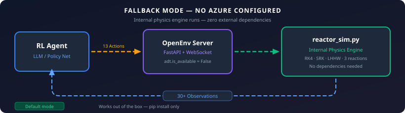
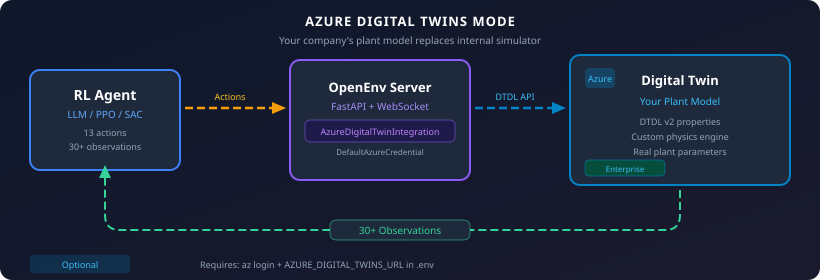

# Azure Digital Twins Integration Guide

Connect your existing Azure Digital Twin instance to the Methanol APC Environment
for training RL agents on your specific plant model.

## Overview

The integration is **fully optional**. By default, the environment uses its internal
physics engine (`reactor_sim.py`). When you connect an Azure Digital Twin, it replaces
or supplements the internal simulator with your company's plant-specific model.





## Prerequisites

You need these **only** if you choose to use Azure Digital Twins:

| Requirement | Purpose |
|------------|---------|
| Azure subscription | Hosts the Digital Twin instance |
| Azure Digital Twins instance | Your plant model lives here |
| Azure CLI (`az`) | Authentication via `az login` |
| Python packages | `azure-digitaltwins-core`, `azure-identity` |

The default internal simulation mode requires **none of these**.

## Step-by-Step Setup

### 1. Install Azure packages

```bash
pip install azure-digitaltwins-core azure-identity
```

### 2. Create an Azure Digital Twins instance

```bash
# Create resource group
az group create --name methanol-apc-rg --location eastus

# Create Azure Digital Twins instance
az dt create --dt-name methanol-apc-adt --resource-group methanol-apc-rg

# Get the instance URL
az dt show --dt-name methanol-apc-adt --query "hostName" -o tsv
# Output: methanol-apc-adt.api.eus.digitaltwins.azure.net
```

### 3. Assign yourself as owner

```bash
# Get your Azure AD user object ID
USER_ID=$(az ad signed-in-user show --query id -o tsv)

# Assign "Azure Digital Twins Data Owner" role
az dt role-assignment create \
    --dt-name methanol-apc-adt \
    --assignee $USER_ID \
    --role "Azure Digital Twins Data Owner"
```

### 4. Upload the DTDL model

The environment provides a ready-made DTDL model definition:

```python
from methanol_apc_env.cheme_bridge import AzureDigitalTwinBridge

# Export the DTDL model JSON
bridge = AzureDigitalTwinBridge()
dtdl_model = bridge.export_dtdl_model()

import json
with open("methanol_reactor.json", "w") as f:
    json.dump([dtdl_model], f, indent=2)
```

Upload it:
```bash
az dt model create --dt-name methanol-apc-adt --models methanol_reactor.json
```

### 5. Create a twin instance

```bash
az dt twin create \
    --dt-name methanol-apc-adt \
    --dtmi "dtmi:openenv:MethanolReactor;1" \
    --twin-id "methanol-reactor-001" \
    --properties '{
        "temperature": 250.0,
        "pressure": 80.0,
        "catalystHealth": 1.0,
        "feedRateH2": 5.0,
        "feedRateCO": 2.5,
        "coolingWaterFlow": 40.0,
        "coolingWaterTemp": 25.0,
        "compressorPower": 65.0,
        "emergencyShutdown": false
    }'
```

### 6. Configure the environment

Add to your `.env` file (never commit this):

```
AZURE_DIGITAL_TWINS_URL=https://methanol-apc-adt.api.eus.digitaltwins.azure.net
```

### 7. Authenticate

```bash
az login
```

That's it. `DefaultAzureCredential` will automatically use your `az login` session.

### 8. Use in code

```python
from methanol_apc_env.cheme_bridge import AzureDigitalTwinBridge

# Connect (reads AZURE_DIGITAL_TWINS_URL from environment)
adt = AzureDigitalTwinBridge()

if adt.is_available:
    print("Connected to Azure Digital Twins!")

    # Read twin state
    state = adt.get_twin_state("methanol-reactor-001")
    print(f"Temperature: {state.get('temperature')}°C")

    # Push an agent action to the twin
    adt.push_action("methanol-reactor-001", {
        "feed_rate_h2": 5.5,
        "cooling_water_flow": 45.0,
    })

    # Sync twin state into a ReactorState object
    from methanol_apc_env.server.reactor_sim import ReactorState
    reactor = ReactorState()
    adt.sync_to_reactor_state("methanol-reactor-001", reactor)
    print(f"Synced: T={reactor.temperature}°C, P={reactor.pressure} bar")
else:
    print("Azure DT not configured — using internal simulator")
```

## Authentication Methods

`DefaultAzureCredential` tries these in order — use whichever fits your setup:

| Method | When to Use | Setup |
|--------|------------|-------|
| **Azure CLI** | Local development | `az login` |
| **VS Code** | Developing in VS Code | Sign into Azure extension |
| **Managed Identity** | Production on Azure | Enable MI on VM/Container App |
| **Service Principal** | CI/CD pipelines | Set `AZURE_CLIENT_ID` + `AZURE_TENANT_ID` + `AZURE_CLIENT_SECRET` env vars |

**Important:** Never commit credentials. Use `.env` (in `.gitignore`) or Azure Key Vault.

## DTDL Model Schema

The `MethanolReactor` twin model maps directly to the environment's `ReactorState`:

| DTDL Property | Type | ReactorState Field | Unit |
|---------------|------|-------------------|------|
| `temperature` | double | `temperature` | °C |
| `pressure` | double | `pressure` | bar |
| `catalystHealth` | double | `catalyst_health` | 0–1 |
| `methanolProduced` | double | `methanol_produced` | kg |
| `reactionRate` | double | `reaction_rate` | mol/s |
| `feedRateH2` | double | `feed_rate_h2` | mol/s |
| `feedRateCO` | double | `feed_rate_co` | mol/s |
| `coolingWaterFlow` | double | `cooling_water_flow` | L/min |
| `coolingWaterTemp` | double | `cooling_water_temp` | °C |
| `compressorPower` | double | `compressor_power` | kW |
| `cumulativeProfit` | double | `cumulative_profit` | $ |
| `h2CoRatio` | double | `h2_co_ratio` | — |
| `emergencyShutdown` | boolean | `emergency_shutdown` | — |

Model ID: `dtmi:openenv:MethanolReactor;1`

## Architecture


## Cost Estimate

| Resource | Cost (approx.) |
|----------|:-------------:|
| Azure Digital Twins | ~$0.025 per 1000 operations |
| Training run (10K steps) | ~$0.25 |
| Azure CLI / SDK | Free |

For development/testing, the internal simulator is free and requires no Azure resources.

## Troubleshooting

| Issue | Solution |
|-------|---------|
| `ModuleNotFoundError: azure` | `pip install azure-digitaltwins-core azure-identity` |
| `DefaultAzureCredential failed` | Run `az login` or check service principal env vars |
| `Twin not found` | Verify twin ID with `az dt twin show --dt-name <name> --twin-id <id>` |
| `Permission denied` | Assign "Azure Digital Twins Data Owner" role to your user |
| `Connection timeout` | Check `AZURE_DIGITAL_TWINS_URL` matches your instance hostname |
