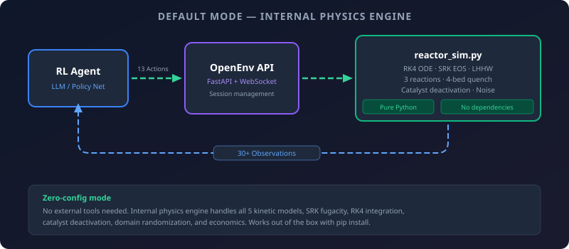

# External Integrations

All integrations are **fully optional**. The environment runs standalone using internal physics models (SRK EOS, LHHW kinetics, RK4 ODE). External tools are for cross-validation, higher-fidelity thermodynamics, or connecting to enterprise plant models.

```python
from methanol_apc_env.integrations import (
    DWSIMIntegration,
    CanteraIntegration,
    ChemSepIntegration,
    AzureDigitalTwinIntegration,
)
```

---

## How Integrations Work



Every integration follows the **same pattern** — try the external tool, fall back to internal model if unavailable:

```python
integration = DWSIMIntegration()

# Check availability
if integration.is_available:
    print("Using DWSIM engine")
else:
    print("DWSIM not found — using internal SRK model")

# API is identical regardless of which engine is used
thermo = integration.get_thermodynamic_properties(T=523.15, P=80e5)
print(f"Source: {thermo.source}")  # "dwsim" or "internal_srk"
print(f"Fugacity H₂: {thermo.fugacity_coefficients['H2']}")
```

The `source` field always tells you which engine produced the result.

---

## Available Integrations

| Integration | External Tool | What It Adds | Fallback Engine | Install |
|------------|---------------|-------------|----------------|---------|
| [`DWSIMIntegration`](dwsim.md) | [DWSIM](https://dwsim.org) | SRK/PR property packages, flowsheet loading, stream import/export | Pure-Python SRK cubic EOS with Newton solver | `pip install pythonnet` + [DWSIM download](https://dwsim.org/index.php/downloads) |
| [`CanteraIntegration`](cantera.md) | [Cantera](https://cantera.org) | GRI-Mech 3.0 reaction rates, equilibrium composition, mechanism validation | LHHW kinetics matching `reactor_sim.py` | `pip install cantera` |
| [`ChemSepIntegration`](chemsep.md) | [ChemSep](http://www.chemsep.org) | CAPE-OPEN VLE, activity coefficients, rigorous bubble point | Antoine equation + Margules model | [ChemSep download](http://www.chemsep.org) + `pip install pywin32` |
| [`AzureDigitalTwinIntegration`](azure-digital-twins.md) | [Azure Digital Twins](https://azure.microsoft.com/en-us/products/digital-twins) | Enterprise plant model as simulation backend, DTDL schema, twin CRUD | Internal `reactor_sim.py` | `pip install azure-digitaltwins-core azure-identity` + `az login` |
| [`OPCUABridge`](opcua.md) | OPC-UA (DCS/SCADA) | Bi-directional connection to real plant DCS — server + client mode, ISA-95 tags | No plant connection | `pip install asyncua` |
| [`StateStore`](redis-state-store.md) | [Redis](https://redis.io/) | Shared state for multi-agent coordination, energy price caching, atomic counters | Thread-safe in-memory `dict` | `pip install redis` |

---

## When to Use Each Integration

| Scenario | Recommended Integration |
|----------|------------------------|
| **Default / hackathon** | None — internal models are sufficient |
| **Validating fugacity coefficients** | DWSIM — compare against commercial-grade SRK |
| **Checking reaction rates** | Cantera — cross-reference with GRI-Mech database |
| **Validating distillation model** | ChemSep — rigorous VLE with NRTL/UNIFAC |
| **Enterprise deployment** | Azure DT — replace internal sim with your company's own plant model |
| **Connecting to real plant** | OPC-UA — shadow mode first, then pilot, then production |
| **Multi-agent coordination** | Redis StateStore — shared state, price caching, violation counters |
| **Academic paper** | DWSIM + Cantera — show your model matches external solvers |

---

## Integration Architecture

Each integration is a separate Python module in `methanol_apc_env/integrations/`:

```
integrations/
├── __init__.py              # Re-exports all 4 classes
├── dwsim.py                 # DWSIMIntegration (pythonnet .NET interop)
├── cantera_kinetics.py      # CanteraIntegration (ct.Solution API)
├── chemsep.py               # ChemSepIntegration (COM/CAPE-OPEN)
└── azure_digital_twins.py   # AzureDigitalTwinIntegration (Azure SDK)
```

### Design Principles

1. **Optional dependencies** — no integration requires its external tool to be installed. Import always works.
2. **Identical API** — the same method call with the same parameters returns the same data structure regardless of which engine runs.
3. **Graceful degradation** — `is_available` property tells you which mode you're in. No exceptions thrown on missing tools.
4. **Source tracking** — every result has a `source` field: `"dwsim"`, `"cantera"`, `"internal_srk"`, `"internal_lhhw"`, `"antoine_margules"`, etc.

---

## Quick Comparison

Running all 4 integrations on the same conditions (250°C, 80 bar, typical syngas composition):

```python
from methanol_apc_env.integrations import *

# Thermodynamics comparison
dwsim = DWSIMIntegration()
thermo = dwsim.get_thermodynamic_properties(T=523.15, P=80e5)
print(f"DWSIM Z = {thermo.compressibility_factor}")
# Internal SRK: Z ≈ 0.92, DWSIM SRK: Z ≈ 0.91 (< 2% difference)

# Kinetics comparison
cantera = CanteraIntegration()
rates = cantera.get_reaction_rates(T=523.15, P=80e5,
    X={"CO": 0.10, "H2": 0.65, "CO2": 0.05, "CH3OH": 0.01, "H2O": 0.01})
print(f"Cantera R1 = {rates.rate_co_hydrogenation:.4e}")
# Internal LHHW and Cantera typically agree within 10-20%

# VLE comparison
chemsep = ChemSepIntegration()
vle = chemsep.get_vle(T=337.7, P=1.013e5,
    compounds=["CH3OH", "H2O"], x={"CH3OH": 0.5, "H2O": 0.5})
for v in vle:
    print(f"{v.compound}: Psat = {v.p_sat_bar:.4f} bar, γ = {v.activity_coefficient:.3f}")

# Azure DT
adt = AzureDigitalTwinIntegration()
if adt.is_available:
    state = adt.get_twin_state("methanol-reactor-001")
```
