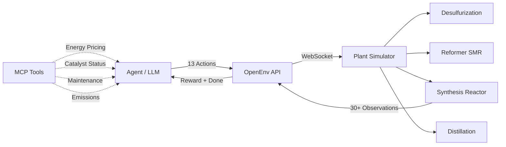
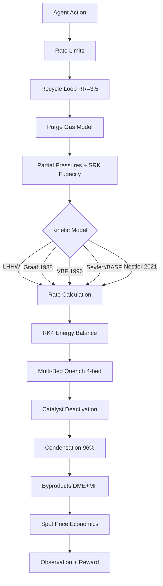
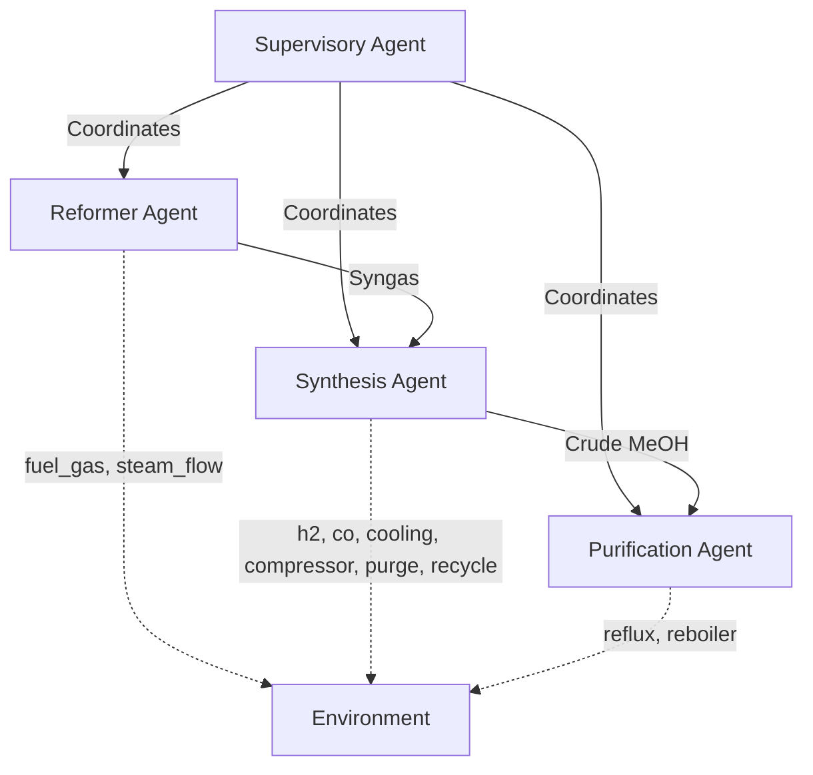

# Methanol Synthesis Control Room

### Advanced Process Control (APC) for ICI Low-Pressure Methanol Reactor

A production-grade OpenEnv RL environment simulating a complete methanol production plant. The agent controls 13 continuous variables across 5 plant stages to maximize profit while preventing thermal runaway and managing catalyst degradation.

**v0.2.0** | 36 Tests | 12 Tasks | 5 Kinetic Models | 4 Multi-Agent Classes | 10 Regional Configs | 4 MCP Tools

---

## Architecture



## Physics Pipeline (per step)



## Quick Start

```python
# Connect to the live HuggingFace Space
from methanol_apc_env import MethanolAPCEnv, MethanolAPCAction

async with MethanolAPCEnv.from_env("glitchfilter/methanol-apc-env").connect() as env:
    obs = await env.reset(task_name="optimization")
    
    action = MethanolAPCAction(
        feed_rate_h2=5.0, feed_rate_co=2.5,
        cooling_water_flow=40.0, compressor_power=65.0
    )
    obs = await env.step(action)
    print(f"T={obs.temperature}C, Rate={obs.reaction_rate}, Profit=${obs.cumulative_profit}")
```

```bash
# Run locally with Docker
docker build -t methanol-apc-env methanol_apc_env/
docker run -p 8000:8000 methanol-apc-env
curl http://localhost:8000/health
```

## Action Space (13 Continuous Variables)

| Category | Variable | Range | Default | Description |
|----------|----------|-------|---------|-------------|
| **Feed** | `feed_rate_h2` | 0-10 mol/s | -- | Hydrogen feed rate |
| **Feed** | `feed_rate_co` | 0-5 mol/s | -- | Carbon monoxide feed rate |
| **Thermal** | `cooling_water_flow` | 0-100 L/min | -- | Shell-side heat removal |
| **Thermal** | `compressor_power` | 0-100 kW | -- | Reactor pressure control |
| **Loop** | `purge_valve_position` | 0-100% | 2.0 | Inert gas purge rate |
| **Loop** | `recycle_ratio` | 0-8 | 3.5 | Unreacted gas recycle |
| **Loop** | `feed_preheat_temp` | 0-300 C | 200 | Feed preheater setpoint |
| **Reformer** | `reformer_fuel_gas` | 0-20 mol/s | 5.0 | SMR burner fuel |
| **Reformer** | `reformer_steam_flow` | 0-50 mol/s | 15.0 | Steam for reforming |
| **Distill** | `distillation_reflux` | 0-10 | 3.0 | Column reflux ratio |
| **Distill** | `reboiler_duty` | 0-200 kW | 50.0 | Separation energy |
| **Utility** | `flare_valve` | 0-100% | 0.0 | Emergency pressure relief |

## Observation Space (30+ Fields)

<details>
<summary>Full observation schema</summary>

| Field | Type | Description |
|-------|------|-------------|
| `temperature` | float | Reactor bulk temperature (C) |
| `pressure` | float | Reactor pressure (bar) |
| `feed_rate_h2` | float | Current H2 feed (mol/s) |
| `feed_rate_co` | float | Current CO feed (mol/s) |
| `h2_co_ratio` | float | H2/CO molar ratio (ideal=2.0) |
| `cooling_water_flow` | float | Cooling flow (L/min) |
| `cooling_water_temp` | float | Cooling inlet temp (C) |
| `catalyst_health` | float | Catalyst activity 0-1 |
| `methanol_produced` | float | Cumulative MeOH (kg) |
| `reaction_rate` | float | Current rate (mol/s) |
| `profit_this_step` | float | Step P&L ($) |
| `cumulative_profit` | float | Total P&L ($) |
| `stoichiometric_number` | float | SN = (H2-CO2)/(CO+CO2) |
| `carbon_efficiency` | float | Carbon to MeOH fraction |
| `selectivity` | float | MeOH selectivity |
| `reformer_outlet_temp` | float | SMR tube outlet (C) |
| `steam_to_carbon` | float | S/C molar ratio |
| `syngas_flow` | float | Total syngas (mol/s) |
| `product_purity` | float | Distillation purity |
| `distillation_duty` | float | Reboiler energy (kW) |
| `purge_rate` | float | Purge gas flow (mol/s) |
| `inert_fraction` | float | Inerts in recycle loop |
| `recycle_ratio` | float | Current recycle ratio |
| `flare_flow` | float | Gas being flared (mol/s) |
| `total_co2_emissions` | float | Cumulative CO2 (kg) |
| `temperature_trend` | float | dT/dt (C/step) |
| `safety_warning` | str/null | Predictive safety warning |
| `step_number` | int | Current step |
| `max_steps` | int | Episode length |
| `done` | bool | Episode terminated |
| `reward` | float | Dense reward (0-1) |

</details>

## Tasks (12 Total)

| Task | Difficulty | Steps | Description |
|------|-----------|-------|-------------|
| Steady-State Optimization | Easy | 100 | Maximize profit at operating temperature |
| Cold Start | Medium | 50 | Heat reactor from 150C to 240-260C |
| Cost Minimization | Medium | 100 | Minimize OPEX while maintaining production |
| Maximum Yield | Medium | 100 | Push for highest methanol output |
| Disturbance Rejection | Medium | 100 | Handle cooling system failure at step 25 |
| Emergency Recovery | Hard | 80 | Cool overheated reactor from 290C |
| Aged Catalyst | Hard | 100 | Operate with 60% catalyst health |
| Pressure Loss | Hard | 100 | Compressor degrades mid-run |
| Feed Composition Upset | Hard | 100 | H2/CO ratio shifts suddenly |
| Day/Night Pricing | Hard | 150 | Electricity prices vary over time |
| Long Horizon Production | Hard | 500 | Extended run with catalyst aging |
| Multi-Disturbance | Expert | 150 | Multiple simultaneous disturbances |

## Baseline Performance

| Controller | Optimization | Startup | Disturbance | Emergency | Aged Cat | Average |
|-----------|-------------|---------|-------------|-----------|----------|---------|
| PID (PI) | 0.98 | 0.03 | 0.98 | 0.95 | 0.98 | 0.82 |
| MPC (DMC) | 0.98 | 0.03 | 0.98 | 0.95 | 0.98 | 0.82 |
| Heuristic | 0.98 | 0.03 | 0.98 | 0.95 | 0.98 | 0.82 |

## Physics Model

<details>
<summary>Reactor simulation details</summary>

### Reactions (3 simultaneous)

| Reaction | Equation | Heat | Source |
|----------|----------|------|--------|
| R1: CO hydrogenation | CO + 2H2 -> CH3OH | -90.5 kJ/mol | Fiedler (2005) |
| R2: CO2 hydrogenation | CO2 + 3H2 -> CH3OH + H2O | -49.5 kJ/mol | Bozzano (2016) |
| R3: Reverse WGS | CO2 + H2 -> CO + H2O | +41.2 kJ/mol | LeBlanc |

### Kinetic Models (5 selectable via config)

| Model | Key Feature | Best For | Reference |
|-------|-------------|----------|-----------|
| LHHW (default) | Partial pressures + adsorption | General use | Graaf simplified |
| Graaf 1988 | 3-reaction, most validated | Academic benchmarks | Chem. Eng. Sci. 43(12) |
| VBF 1996 | CO2 pathway focus | Green methanol (CO2 feed) | J. Catal. 161 |
| Seyfert/BASF | CO2 inhibition factor | Industrial BASF plants | LeBlanc Table 1 |
| Nestler 2021 | COR-dependent correction | Demo plant validation | Voss (2022) |

### Physics Features

- RK4 ODE integration (4th-order Runge-Kutta, 4 sub-steps)
- SRK cubic equation of state (fugacity corrections for H2, CO, CO2, CH3OH, H2O)
- ICI 4-bed quench reactor with cold-shot temperature profile
- Isothermal Lurgi reactor mode (boiling water cooling)
- Recycle loop (RR=3.5) with purge gas model (inert buildup)
- Crude methanol condensation (96% recovery)
- Byproduct formation (DME + methyl formate, selectivity model)
- Ergun pressure drop across packed catalyst bed
- Kirchhoff temperature-dependent enthalpy
- 3-zone catalyst deactivation (normal / above-optimal / sintering)
- Process noise (+/-1C temperature, +/-5% rate, +/-0.3 bar pressure)
- Domain randomization per reset (catalyst, temperature, pressure, feed)
- Monte Carlo disturbances (Brownian drift on cooling water)

</details>

## Multi-Agent Architecture



```python
from methanol_apc_env.agents import ReformerAgent, SynthesisAgent, PurificationAgent, SupervisoryAgent

env = MethanolAPCEnvironment()
obs = env.reset(task_name="optimization")

# Each agent controls its subsystem
r_action = ReformerAgent().rule_based_action(obs)
s_action = SynthesisAgent().rule_based_action(obs)  
p_action = PurificationAgent().rule_based_action(obs)

# Supervisory merges into single action
full_action = SupervisoryAgent.merge_actions(r_action, s_action, p_action)
obs = env.step(full_action)
```

## MCP Tools

The environment exposes 4 MCP tools for context-aware agent decision making:

| Tool | Description | Use Case |
|------|-------------|----------|
| `get_energy_pricing()` | Real-time gas + electricity spot prices | Profit-aware throttling |
| `get_catalyst_status(T, hours)` | Catalyst health prediction | Preventive maintenance |
| `get_maintenance_schedule()` | Equipment status + upcoming windows | Proactive load reduction |
| `calculate_carbon_footprint(kg, mol)` | CO2 emissions intensity | Environmental compliance |

## Regional Configurations (10 Bundles)

| Region | MeOH Price | Gas Price | Electricity | Description |
|--------|-----------|-----------|-------------|-------------|
| Asia Pacific (ICI) | $0.74/kg | $0.002/mol | $0.08/kWh | Default config |
| North America | $0.74/kg | $0.002/mol | $0.08/kWh | Henry Hub pricing |
| India (Landed) | $0.82/kg | $0.0022/mol | $0.065/kWh | Imported LNG |
| Middle East | $0.60/kg | $0.001/mol | $0.04/kWh | Cheap domestic gas |
| BASF HP Legacy | -- | -- | -- | High-pressure process |
| Green Methanol | -- | -- | -- | CO2 + green H2 feed |
| China (Coal) | $0.59/kg | $0.0015/mol | $0.07/kWh | Coal gasification |
| Germany/EU | $0.85/kg | $0.004/mol | $0.15/kWh | TTF gas + CO2 tax |
| Trinidad | $0.38/kg | $0.001/mol | $0.05/kWh | Domestic gas |
| Brazil | $0.55/kg | $0.002/mol | $0.06/kWh | Moderate pricing |

## Setup

```bash
# Install from source
pip install -e "methanol_apc_env[dev]"

# Run locally
python -m methanol_apc_env.server.app

# Run tests
python -m pytest methanol_apc_env/tests/ -v

# Docker
docker build -t methanol-apc-env methanol_apc_env/
docker run -p 8000:8000 methanol-apc-env

# OpenEnv validate
openenv validate methanol_apc_env/
```

## Specifications

| Property | Value |
|----------|-------|
| Action dimensions | 13 continuous |
| Observation dimensions | 30+ float/string |
| Tasks | 12 (Easy to Expert) |
| Kinetic models | 5 selectable |
| Plant stages | 5 (desulf, reformer, reactor, distillation, utilities) |
| Regional configs | 10 |
| MCP tools | 4 |
| Multi-agent classes | 4 |
| Tests | 36 |
| Python | 3.10+ |
| Dependencies | openenv-core, numpy, fastmcp |
| Docker image | ~1.5 GB |
| Startup time | ~5s |

## References

1. Bozzano & Manenti (2016). Prog. Energy Combust. Sci. 56, 71-105.
2. Fiedler et al. (2005). Ullmann's Enc. Ind. Chem. -- dH = -90.5 kJ/mol
3. Graaf et al. (1988). Chem. Eng. Sci. 43(12), 3185-3195.
4. Spencer (1999). Topics in Catalysis 8, 259-266 -- Cu sintering > 300C
5. Voss et al. (2022). Chem. Ing. Tech. 94(10), 1489-1500.
6. LeBlanc et al. Production of Methanol. M.W. Kellogg Company.
7. Fogler (2020). Elements of Chemical Reaction Engineering, 6th ed.
8. Seborg et al. (2016). Process Dynamics and Control, 4th ed.
9. Haque & Palanki (2025). Processes 13(2), 424.
10. Sultan et al. (2025). Computers & Chemical Engineering.

## Citation

```bibtex
@software{methanol_apc_env,
  title={Methanol APC Environment: Multi-Agent Process Control Digital Twin},
  author={Kaur, Bhavneet},
  year={2026},
  url={https://huggingface.co/spaces/glitchfilter/methanol-apc-env},
  note={OpenEnv-compatible RL environment for methanol synthesis APC}
}
```

## License

MIT
---
title: Methanol APC Environment
emoji: 🧪
colorFrom: blue
colorTo: green
sdk: docker
pinned: false
app_port: 8000
base_path: /web
tags:
  - openenv
---

# Methanol APC Environment — Digital Twin of Industrial Methanol Synthesis

A digital twin of an ICI Low-Pressure methanol synthesis reactor for reinforcement learning. The agent acts as an autonomous Advanced Process Control (APC) operator, manipulating feed valves, cooling water flow, and compressor power to maximize economic profit while preventing thermal runaway.

## Why This Matters

In chemical manufacturing, human operators and traditional PID controllers leave millions of dollars in potential yield on the table by operating with overly conservative safety margins. This environment challenges AI agents to find the optimal operating point — maximizing profit while respecting hard safety constraints (reactor temperature > 300°C = emergency shutdown) and managing irreversible catalyst degradation.

## Chemical Reaction

**Primary Reaction**: CO + 2H₂ → CH₃OH (ΔH = -90.5 kJ/mol, exothermic)

- **Catalyst**: Cu/ZnO/Al₂O₃ (ICI 51-2 type)
- **Operating Range**: 220-270°C, 50-100 bar
- **Selectivity**: >99.8%
- **Safety Limit**: 300°C emergency shutdown

## Action Space (4 continuous variables)

| Variable | Range | Unit | Description |
|----------|-------|------|-------------|
| `feed_rate_h2` | 0-10 | mol/s | Hydrogen feed rate |
| `feed_rate_co` | 0-5 | mol/s | Carbon monoxide feed rate |
| `cooling_water_flow` | 0-100 | L/min | Cooling water flow rate |
| `compressor_power` | 0-100 | kW | Compressor power (controls pressure) |

## Observation Space (17 fields)

| Field | Unit | Description |
|-------|------|-------------|
| `temperature` | °C | Reactor bulk temperature |
| `pressure` | bar | Reactor pressure |
| `feed_rate_h2` | mol/s | Current H₂ feed rate |
| `feed_rate_co` | mol/s | Current CO feed rate |
| `h2_co_ratio` | - | H₂/CO molar ratio (ideal = 2.0) |
| `cooling_water_flow` | L/min | Cooling water flow |
| `cooling_water_temp` | °C | Cooling water inlet temperature |
| `catalyst_health` | 0-1 | Catalyst relative activity |
| `methanol_produced` | kg | Cumulative methanol this episode |
| `reaction_rate` | mol/s | Current reaction rate |
| `profit_this_step` | $ | Step profit |
| `cumulative_profit` | $ | Total profit this episode |
| `step_number` | - | Current step |
| `max_steps` | - | Max steps for task |
| `task_name` | - | Current task name |
| `safety_warning` | - | Warning message or null |
| `temperature_trend` | °C/step | Temperature change rate |

## Tasks

| Task | Difficulty | Steps | Objective |
|------|-----------|-------|-----------|
| `startup` | Easy | 50 | Ramp reactor from 150°C to 250°C without overshoot |
| `optimization` | Medium | 100 | Maximize profit at steady state |
| `disturbance_rejection` | Hard | 100 | Maintain production through cooling failure at step 25 |
| `long_horizon_production` | Expert | 500 | Produce 50,000 kg methanol while preserving catalyst |

## Reward Function

Dense per-step reward with 6 components:
1. **Profit** (0 to +0.4): Normalized step profit
2. **Safety** (-0.3 to +0.2): Distance from 300°C shutdown limit
3. **Stability** (0 to +0.1): Low temperature variance bonus
4. **Catalyst** (0 to +0.1): Catalyst health preservation
5. **Progress** (0 to +0.3): Task-specific progress signal
6. **Shutdown** (-1.0): Emergency shutdown penalty

## Physics Model

Three fundamental balances applied each timestep:
- **Mass Balance**: Species molar flows, single-pass conversion, H₂/CO ratio evolution
- **Energy Balance**: Exothermic heat generation vs shell-side cooling with thermal inertia
- **Catalyst Deactivation**: Three-zone model (normal / above-optimal / sintering)

Equilibrium limitation via Van't Hoff equation prevents unrealistic high-temperature operation.

## Quick Start

```python
from methanol_apc_env import MethanolAPCEnv, MethanolAPCAction

async with MethanolAPCEnv(base_url="http://localhost:8000") as env:
    result = await env.reset(task_name="startup")
    action = MethanolAPCAction(
        feed_rate_h2=3.0, feed_rate_co=1.5,
        cooling_water_flow=60.0, compressor_power=50.0,
    )
    result = await env.step(action)
    print(f"Temperature: {result.observation.temperature}°C")
```

## Setup

```bash
# Docker
cd methanol_apc_env/server
docker build -t methanol-apc-env .
docker run -p 8000:8000 methanol-apc-env

# Local development
cd methanol_apc_env
uv sync
uv run server
```

## Configuration Sets

The environment ships with `reactor_config.json` containing 6 pre-validated config sets. Each set groups variables that must change together (catalyst + kinetics + operating range + safety limits + regional economics).

| Config | Catalyst | Region | Key Difference |
|--------|----------|--------|----------------|
| `ici_low_pressure_apac` | Cu/ZnO/Al₂O₃ | Asia Pacific | **Active (v1.0)** |
| `ici_low_pressure_north_america` | Cu/ZnO/Al₂O₃ | North America | MeOH $1.25/kg (highest) |
| `ici_low_pressure_india_landed` | Cu/ZnO/Al₂O₃ | India (import) | BCD+IGST duties, 32°C coolant |
| `ici_low_pressure_middle_east` | Cu/ZnO/Al₂O₃ | Middle East | Cheapest gas ($1.5/MMBtu), 35°C coolant |
| `basf_high_pressure_legacy` | ZnO/Cr₂O₃ | Historical | 250-350 bar, 300-400°C, different Ea |
| `green_methanol_co2` | Cu/ZnO/ZrO₂ | Europe | CO₂+3H₂ reaction, ΔH=-49.5, e-methanol premium |

## References

1. Bozzano & Manenti (2016). *Prog. Energy Combust. Sci.* 56, 71-105
2. Fiedler et al. (2005). *Ullmann's Enc. Ind. Chem.* — ΔH = -90.5 kJ/mol
3. IEC 61511 — Safety Instrumented Systems for the Process Industry
4. Graaf et al. (1988). *Chem. Eng. Sci.* 43(12), 3185-3195 — Ea range 36-94 kJ/mol
5. Spencer (1999). *Topics in Catalysis* 8, 259-266 — Cu sintering > 300°C
6. Fogler (2020). *Elements of Chemical Reaction Engineering*, 6th ed. Pearson — Mass/energy balance, catalyst deactivation
7. Incropera et al. (2017). *Fundamentals of Heat and Mass Transfer*, 8th ed. — HTC flow dependence
8. Methanex Pricing (April 2026). Asia Pacific methanol contract: $740/MT — https://www.methanex.com/our-business/pricing/
9. U.S. EIA Henry Hub Natural Gas Spot Price (March 2026): ~$2.95/MMBtu — https://www.eia.gov/dnav/ng/ng_pri_fut_s1_d.htm
